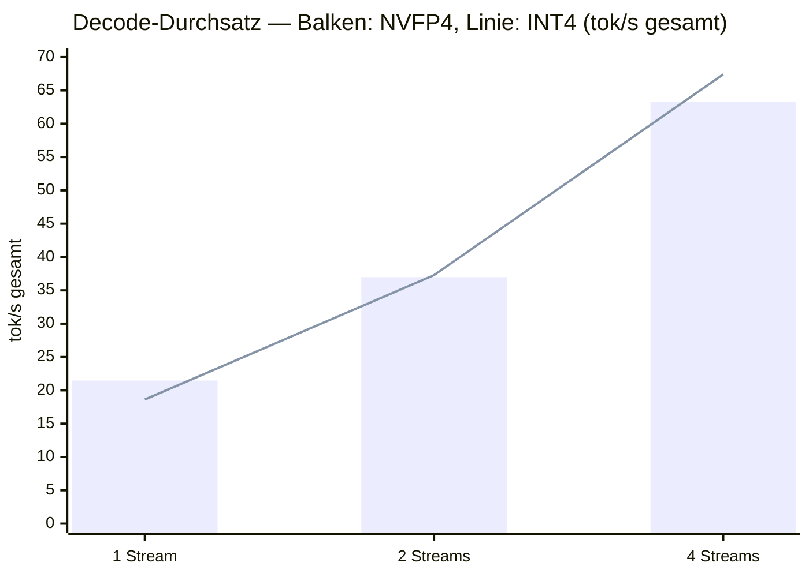
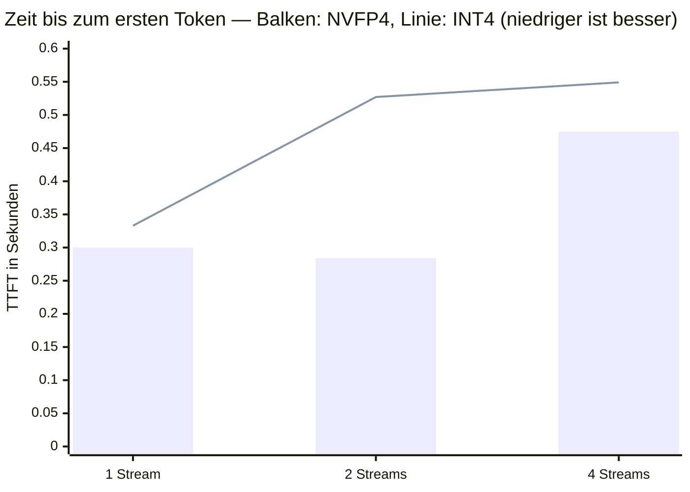
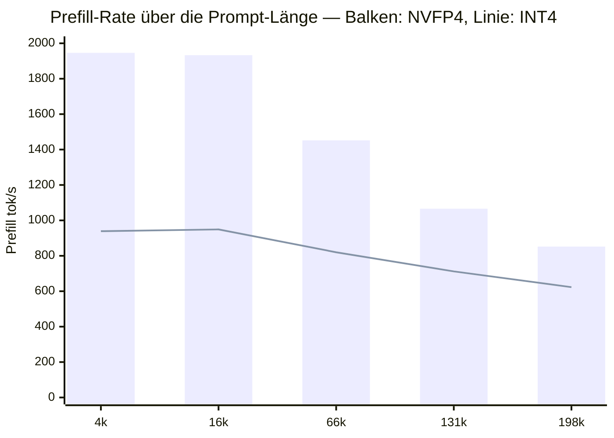
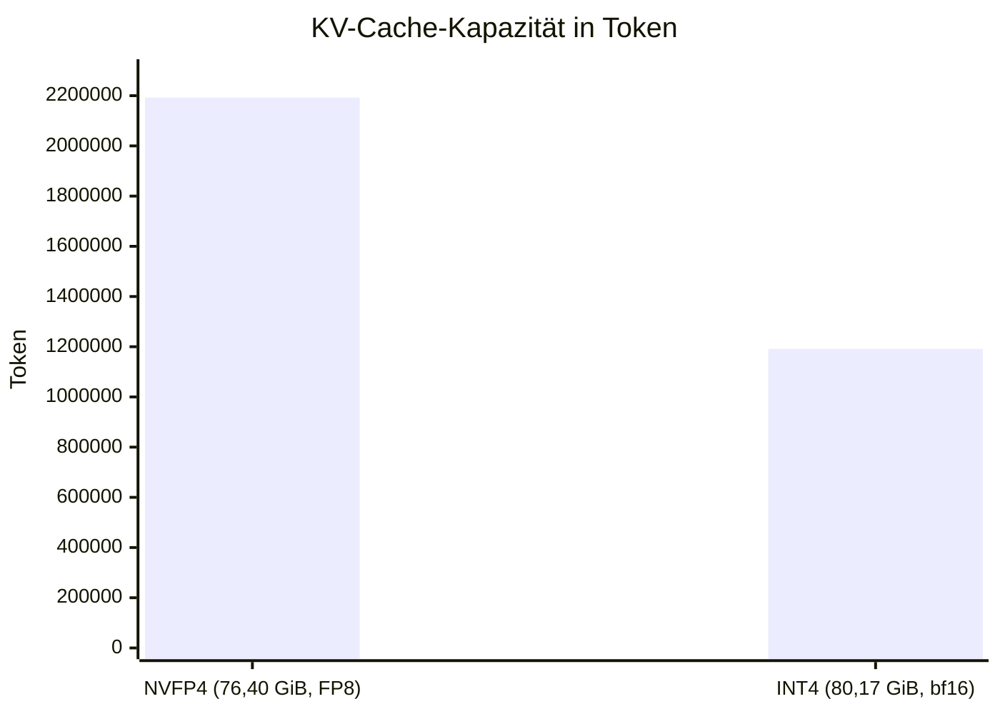

# Qwen3.8-27B auf dem DGX Spark

*Messreihe · DGX Spark GB10 · 21. August 2026*

> Zwei 4-Bit-Varianten desselben dense Modells, unter identischen Parametern gegeneinander gemessen: NVFP4 gegen INT4. Der Durchsatzvergleich kippt mit der Last, der Prefill-Vergleich nicht — und der größte Unterschied steht in keiner der beiden Modellkarten.

**Hardware** NVIDIA GB10, sm_121a, 121 GB unified **Engine** vLLM 0.25.1 / torch 2.11.0+cu130 **Messpunkte** 2 × 12 Durchsatz, 2 × 5 Prefill

## Inhalt

1. [Auf einen Blick](#auf-einen-blick)
2. [Kernaussagen](#kernaussagen)
3. [Modell und Varianten](#modell-und-varianten)
4. [Testaufbau](#testaufbau)
5. [Startverlauf](#startverlauf)
6. [Decode-Durchsatz](#decode-durchsatz)
7. [Antwortlatenz](#antwortlatenz)
8. [Prefill-Skalierung](#prefill-skalierung)
9. [Der fehlende Präfix-Cache](#der-fehlende-präfix-cache)
10. [Speicher und KV-Cache](#speicher-und-kv-cache)
11. [Kernel-Pfade](#kernel-pfade)
12. [Spekulatives Decoding](#spekulatives-decoding)
13. [Einordnung](#einordnung)
14. [Empfehlung](#empfehlung)
15. [Limitationen](#limitationen)
16. [Glossar](#glossar)
17. [Artefakte](#artefakte)

## Auf einen Blick

Qwen3.8-27B ist ein **dense** Vision-Language-Modell mit hybrider Attention und eingebautem MTP-Kopf. Beide 4-Bit-Varianten wurden mit identischen Parametern auf demselben Gerät gemessen. Keine der beiden gewinnt auf ganzer Linie.

### Decode: die Last entscheidet

NVFP4 liegt bei einem Stream 16 % vorn, INT4 bei vier Streams 6 %. Der Wechsel liegt zwischen c=2 und c=4 — dasselbe Muster wie bei Gemma-4, jetzt auch auf einem dense Modell.

### Prefill: NVFP4 durchgehend

Faktor 2,04 bei kurzen Prompts, 1,37 bei 198k. Kein Umschlagpunkt. W4A16 muss die Gewichte für jede GEMM entpacken, was den rechenlastigen Prefill trifft.

### KV-Cache: fast doppelt

NVFP4 fasst 2,19 Mio. Token, INT4 nur 1,19 Mio. — bei *weniger* Cache-Speicher. Ursache sind fehlende `k_scale`/`v_scale` im INT4-Checkpoint.

### 27 B aktiv, trotzdem 21,5 tok/s

Rechnerisch wären ~9 tok/s zu erwarten. Der MTP-Kopf akzeptiert 76–89 % seiner Entwürfe und hebt das Ergebnis auf das Niveau eines 8-B-MoE.

- **21,5** — tok/s Decode c=1, NVFP4

- **70,9** — tok/s Decode c=4, INT4

- **2,04×** — Prefill-Vorsprung NVFP4

- **1,0×** — Präfix-Cache-Effekt

## Kernaussagen

1. **Der NVFP4-INT4-Umschlagpunkt ist eine Kernel-Eigenschaft, keine Modell-Eigenschaft.** Gemma-4 (MoE, 4 B aktiv) und Qwen3.8 (dense, 27 B aktiv) zeigen ihn an derselben Stelle mit fast identischen Prozentwerten.

2. **Beim Prefill gibt es keinen Umschlagpunkt.** NVFP4 gewinnt auf allen fünf Längenstufen. Der Vorsprung schrumpft mit der Kontextlänge, weil die in beiden Varianten identische Attention einen wachsenden Anteil der Arbeit übernimmt.

3. **Die KV-Cache-Kapazität steht nicht in der Quantisierung, sondern im Checkpoint.** Der INT4-Checkpoint liefert keine KV-Skalen mit; vLLM fällt auf einen bf16-Cache zurück und halbiert damit die Kapazität. Weder Modellname noch `quantization_config` weisen darauf hin.

4. **Spekulatives Decoding ist der entscheidende Hebel für dense Modelle auf dieser Hardware.** Es hebt die Bandbreitengrenze nicht auf, sondern verteilt sie auf mehrere Token pro Durchgang — genau das, was 27 B aktive Parameter an 273 GB/s brauchen.

5. **Der Präfix-Cache greift auch hier nicht**, obwohl jede vierte Schicht volle Attention ist. vLLM schaltet ihn für Hybridmodelle selbsttätig ab.

6. **Der 262k-Kontext ist nominell vorhanden, praktisch kaum nutzbar.** Allein der Prefill von 198k Token dauert 3:53 min (NVFP4) bzw. 5:18 min (INT4).

## Modell und Varianten

Qwen3.8-27B unterscheidet sich in zwei Punkten grundlegend von den bisher auf diesem Gerät gemessenen Modellen: es ist **dense** statt MoE, und es ist multimodal.

**Architektur** — `Qwen3_5ForConditionalGeneration` — Vision-Language, Textteil `qwen3_5_text`

**Schichten** — 64, davon 48 `linear_attention` und 16 `full_attention` (`full_attention_interval = 4`)

**Attention** — 24 Query-Heads, 4 KV-Heads (GQA), `head_dim` 256, `partial_rotary_factor` 0,25

**Lineare Schichten** — 16 Key-Heads, 48 Value-Heads, je 128 Dimensionen, `mamba_ssm_dtype` float32

**Kontext** — 262 144 Token

**MTP** — `mtp_num_hidden_layers = 1`, Embeddings mit dem Zielmodell geteilt

**Vision** — 27 Blöcke, `hidden_size` 1152, Patch 16 — im Benchmark nicht angesprochen

> [!IMPORTANT]
> **„NVFP4“ heißt hier nicht durchgehend 4 Bit**
>
> Der Checkpoint ist `mixed-precision`: die MLP-Schichten liegen in NVFP4 (W4A4, `tensor_group`, Gruppengröße 16), die Attention-Projektionen dagegen in **FP8** (W8A8, channel-wise). Die `linear_attn`-Blöcke sind vollständig ausgenommen — 303 Einträge in der `ignore`-Liste. Daher 21,81 GiB statt der bei reinem FP4 zu erwartenden rund 14 GiB.

*Die beiden verglichenen Varianten*

|  | unsloth NVFP4 | RedHatAI INT4 |
|---|---|---|
| Revision | 7d6f8d4d | 2fb0debc |
| Checkpoint-Größe | 21,81 GiB | 18,12 GiB |
| Format | mixed-precision | pack-quantized |
| Gewichte MLP | 4 bit float, gs 16 | 4 bit int, gs 128 |
| Gewichte Attention | 8 bit float, channel | 4 bit int, gs 128 |
| Aktivierungen | 4 bit / 8 bit float | bf16 |
| MTP-Tensoren | 15 | 15 |
| `k_scale` / `v_scale` | 16 / 16 | 0 / 0 |

<details>
<summary>Auswahlverfahren — warum diese beiden</summary>

Die HF-API listet über 100 Ableitungen von Qwen3.8-27B. Nach Ausschluss von GGUF, MLX, AMD-Quark und Abliterated-Varianten blieben als ernsthafte 4-Bit-Kandidaten für vLLM auf sm_121a:

| Repo | Größe | Schema |
|---|---|---|
| RedHatAI/…-INT4 | 18,1 GiB | INT4 W4A16, gs 128 |
| sakamakismile/…-MTP-NVFP4 | 19,1 GiB | NVFP4 W4A4 durchgehend |
| cyankiwi/…-AWQ-INT4 | 19,6 GiB | INT4 W4A16, gs 32, AWQ-kalibriert |
| RadixArk/…-NVFP4 | 20,4 GiB | modelopt, MTP in bf16 |
| unsloth/…-NVFP4 | 21,8 GiB | mixed NVFP4 + FP8 |
| RedHatAI/…-NVFP4 | 21,8 GiB | Config identisch zu unsloth |
| Inferact/…-NVFP4 | 24,6 GiB | modelopt |

Gewählt wurden `unsloth/Qwen3.8-27B-NVFP4` und `RedHatAI/Qwen3.8-27B-INT4`: beide `compressed-tensors`, beide Formate auf diesem Gerät bereits erfolgreich gefahren, und mit 21,8 gegen 18,1 GiB nah genug beieinander, dass — anders als bei Laguna — kein Speicherdruck den Vergleich verfälscht.

> [!NOTE]
> **Namensfalle: „DSpark“ ist nicht der DGX Spark**
>
> Mehrere Repos heißen `Qwen3.8-27B-DSpark…` und wirken hardwarespezifisch. Sie sind es nicht: `RadixArk/Qwen3.8-27B-DSpark` ist 2,5 GiB groß, Architektur `DSparkDraftModel` — ein **Draft-Modell für spekulatives Decoding**, DFlash-Nachfolger mit Confidence-Head, 1,36 Mrd. Parameter, 5 Full-Attention-Schichten, Block-Größe 7. Zielmodell ist `Qwen/Qwen3.8-27B-FP8`, Serving laut Modellkarte über SGLang. Nicht Teil dieser Messreihe.

</details>

## Testaufbau

Beide Varianten liefen mit denselben Leistungsparametern, damit ausschließlich die Quantisierung variiert. Die Werte entsprechen denen der Qwen3.6-Messreihe, sodass die Zahlen vergleichbar bleiben.

```bash
# start-vllm-qwen38-{nvfp4,int4}.sh
export CUTE_DSL_ARCH=sm_121a
export MAX_JOBS=1

vllm serve <modell> \
  --revision <gepinnt> \
  --speculative-config '{"method":"mtp","num_speculative_tokens":3}' \
  --reasoning-parser qwen3 \
  --max-num-seqs 32 \
  --max-model-len 262144 \
  --gpu-memory-utilization 0.85 \
  --host 0.0.0.0 --port 8000
```

Gemessen wurde mit den beiden Skripten der bestehenden Messreihe: `bench.py` (4 Szenarien × 3 Nebenläufigkeitsstufen × 3 Wiederholungen, warmer Fall) und `prefill.py` (5 Längenstufen mit je eigener UUID im Präfix, kalter Fall). Beide sprechen die OpenAI-kompatible API, jede Konfiguration erhält identische Anfragen. Vor jeder Messreihe läuft eine Aufwärmanfrage.

> [!NOTE]
> Die Revisionen sind gepinnt. Grund ist die Erfahrung aus der Laguna-Messreihe: poolside hatte `main` auf einen Checkpoint umgestellt, der trotz gleichlautender `quantization_config` andere Gewichte enthielt und die Messwerte entwertete.

## Startverlauf

Beide Server starteten im ersten Anlauf, ohne Fehlversuche. Der Kernel-Cache war vom Qwen3.6-Lauf her bereits warm.

*Zeit bis zur Bereitschaft*

| Phase | NVFP4 | INT4 |
|---|---|---|
| torch.compile Backbone | 55,19 s | 36,81 s |
| torch.compile MTP-Kopf | 6,94 s | 6,67 s |
| CUDA-Graph-Speicher | 0,22 GiB | 0,10 GiB |
| bereit nach | 334 s | 309 s |

Beide Läufe melden `Add 3 padding layers, may waste at most 6.25 %` — eine Folge der hybriden Architektur, bei der die Seitengröße der Attention an die der Mamba-Schichten angeglichen werden muss.

## Decode-Durchsatz

Gesamtdurchsatz über alle nebenläufigen Anfragen, Median aus drei Läufen, Szenario `prosa_decode` mit 256 Ausgabe-Token je Anfrage.



*Der Vorsprung wechselt zwischen zwei und vier Streams die Seite. Bei zwei Streams liegen beide innerhalb von 0,8 % — das ist der Kreuzungspunkt.*

*Alle Decode-Messpunkte, Gesamtdurchsatz in tok/s*

| Szenario | Streams | NVFP4 | INT4 | Differenz |
|---|---|---|---|---|
| prosa_decode | 1 | 21,47 | 18,62 | NVFP4 +15,3 % |
| prosa_decode | 2 | 36,98 | 37,28 | INT4 +0,8 % |
| prosa_decode | 4 | 63,32 | 67,40 | INT4 +6,4 % |
| code_decode | 1 | 19,87 | 18,05 | NVFP4 +10,1 % |
| code_decode | 2 | 39,55 | 38,62 | NVFP4 +2,4 % |
| code_decode | 4 | 65,98 | 70,88 | INT4 +7,4 % |

> [!IMPORTANT]
> **Was hier tatsächlich gemessen wird**
>
> Eine Stichprobe nach dem Lauf ergab bei 120 angeforderten Token **531 Zeichen im Feld `reasoning` und ein leeres `content`**. Bei 256 Token je Anfrage misst der Decode-Durchsatz hier also fast ausschließlich die Erzeugung von Reasoning-Token; eine fertige Antwort entsteht in keinem der Läufe. Die Rate ist als Rate gültig, sie ist aber kein Maß für die Zeit bis zur Antwort. Der Unterschied zwischen `prosa_decode` und `code_decode` ist aus demselben Grund nicht belastbar.

## Antwortlatenz

Zeit bis zum ersten Token, Median, Szenario `prosa_decode` mit kurzem Prompt (35 Eingabe-Token).



*Bei kurzen Prompts liegt NVFP4 auf allen Stufen vorn — im Gegensatz zum Decode-Durchsatz, wo INT4 ab vier Streams gewinnt. Der Ausreißer bei zwei Streams (0,527 s) ist der einzige Punkt, an dem INT4 deutlich abfällt.*

<details>
<summary>Rohdaten — alle TTFT-Messpunkte</summary>

*Zeit bis zum ersten Token, Median aus drei Läufen*

| Szenario | Streams | NVFP4 | INT4 | Differenz |
|---|---|---|---|---|
| prosa_decode | 1 | 0,300 s | 0,333 s | NVFP4 −9,9 % |
| prosa_decode | 2 | 0,284 s | 0,527 s | NVFP4 −46,1 % |
| prosa_decode | 4 | 0,475 s | 0,549 s | NVFP4 −13,5 % |
| code_decode | 1 | 0,272 s | 0,336 s | NVFP4 −19,0 % |
| code_decode | 2 | 0,291 s | 0,389 s | NVFP4 −25,2 % |
| code_decode | 4 | 0,471 s | 0,521 s | NVFP4 −9,6 % |

NVFP4 liegt auf allen zwölf Latenzmesspunkten vorn — anders als beim Durchsatz gibt es hier keinen Lastbereich, in dem INT4 gewinnt. Der Vorsprung schwankt zwischen 9,6 und 46,1 %, ohne erkennbaren Trend über die Nebenläufigkeit.

</details>

Beide Varianten liegen deutlich über den 0,094 s von Qwen3.6 und den 0,036 s von Gemma-4. Das ist erwartbar: Selbst bei 35 Eingabe-Token muss ein dense Modell für das erste Token seine vollständigen Gewichte durch den Speicherbus ziehen.

## Prefill-Skalierung

Kalte Messung: jede Anfrage erhält eine eigene UUID im Präfix, sodass kein Cache greifen kann. Fünf Längenstufen, Median aus drei Anfragen.



*Der Abstand zwischen den Linien ist der NVFP4-Vorsprung; die grauen Werte geben ihn als Faktor an. Er schrumpft mit der Kontextlänge, kehrt sich aber nie um.*

Die Ursache liegt in der Bedeutung von **W4A16**: INT4 hält die Aktivierungen in bf16 und muss die Gewichte für jede Matrixmultiplikation entpacken. Beim bandbreitengebundenen Decode fällt dieser Aufwand nicht ins Gewicht — dort ist er sogar von Vorteil, weil Marlin ihn über den Batch amortisiert. Beim rechengebundenen Prefill dominiert er, während der W4A4-Pfad von NVFP4 die FP4-Tensorkerne direkt bedient.

Dass der Faktor mit der Länge abnimmt, passt dazu: Die Attention ist in beiden Varianten identisch und übernimmt bei wachsendem Kontext einen immer größeren Anteil der Arbeit, wodurch der Unterschied in den linearen Schichten relativ an Gewicht verliert.

*Kaltes Prefill, absolute Zeiten*

| Stufe | Token | NVFP4 TTFT | tok/s | INT4 TTFT | tok/s | Faktor |
|---|---|---|---|---|---|---|
| ~5k | 4 126 | 2,12 s | 1 946 | 4,33 s | 939 | 2,04× |
| ~18k | 16 426 | 8,50 s | 1 933 | 17,31 s | 949 | 2,04× |
| ~72k | 65 875 | 45,38 s | 1 452 | 78,62 s | 820 | 1,73× |
| ~145k | 131 204 | 123,12 s | 1 066 | 181,51 s | 712 | 1,47× |
| ~215k | 198 205 | 232,73 s | 852 | 318,05 s | 623 | 1,37× |

<details>
<summary>Rohdaten — die 8k-Prefill-Szenarien aus bench.py</summary>

Diese sechs Messpunkte je Variante stammen aus `bench.py`, nicht aus `prefill.py`: rund 14 800 Eingabe-Token, nur 64 Ausgabe-Token. Der Gesamtdurchsatz ist hier wenig aussagekräftig, weil ihn die lange Wartezeit auf das erste Token dominiert — er steht der Vollständigkeit halber hier.

| Szenario | Streams | NVFP4 TTFT | NVFP4 gesamt | INT4 TTFT | INT4 gesamt |
|---|---|---|---|---|---|
| prefill_8k | 1 | 7,618 s | 6,14 tok/s | 15,769 s | 3,41 tok/s |
| prefill_8k | 2 | 11,962 s | 7,29 tok/s | 24,991 s | 3,71 tok/s |
| prefill_8k | 4 | 19,819 s | 7,77 tok/s | 41,316 s | 3,82 tok/s |
| prefill_8k_wiederholt | 1 | 7,547 s | 6,25 tok/s | 15,860 s | 3,48 tok/s |
| prefill_8k_wiederholt | 2 | 11,991 s | 7,16 tok/s | 24,957 s | 3,76 tok/s |
| prefill_8k_wiederholt | 4 | 19,799 s | 7,83 tok/s | 41,218 s | 3,87 tok/s |

Zwei Beobachtungen: Der NVFP4-Vorsprung liegt hier durchgehend bei Faktor 2,07–2,09 und damit noch etwas über dem der kalten Messung. Und die Zeilenpaare `prefill_8k` / `prefill_8k_wiederholt` sind bis auf Messrauschen identisch — das ist derselbe fehlende Präfix-Cache, aus einer zweiten Datenquelle bestätigt.

</details>

> [!IMPORTANT]
> **Der lange Kontext ist nominell vorhanden, praktisch kaum nutzbar**
>
> 198 205 Token Prefill kosten **3:53 min** mit NVFP4 und **5:18 min** mit INT4 — bevor das erste Ausgabe-Token erscheint. Zum Vergleich: Qwen3.6-35B-A3B benötigte für dieselbe Stufe 81,6 s. Wer die 262k tatsächlich ausschöpfen will, plant hier in Minuten, nicht in Sekunden.

## Der fehlende Präfix-Cache

Der Benchmark fährt dasselbe 8k-Szenario zweimal: einmal regulär, einmal mit identischem Präfix. Bei Modellen mit funktionierendem Präfix-Cache fällt der zweite Durchlauf dramatisch schneller aus. Hier nicht.

*Warm gegen kalt*

| Variante | kalt (16k, eigener Präfix) | warm (15k, wiederholt) | pro Token | Effekt |
|---|---|---|---|---|
| NVFP4 | 8,50 s | 7,62 s | 0,517 vs 0,514 ms | 1,0× |
| INT4 | 17,31 s | 15,77 s | 1,053 vs 1,063 ms | 1,0× |

Auf die Prompt-Länge normiert sind warm und kalt identisch. Das entspricht dem Befund bei Qwen3.6 — überrascht hier aber mehr, denn Qwen3.8 ist der schärfere Test: **16 seiner 64 Schichten sind volle Attention** mit echtem KV-Cache. Ein teilweiser Cache-Nutzen wäre also architektonisch möglich gewesen.

> [!WARNING]
> **Die Ursache steht in der Engine-Konfiguration**
>
> Beide Server-Logs melden `enable_prefix_caching=False`, obwohl das auf keiner Kommandozeile steht. vLLM schaltet die Funktion für Hybridmodelle selbsttätig ab. Die Architektur macht einen *vollständigen* Präfix-Cache unmöglich — die lineare Attention führt einen sequenziell fortgeschriebenen Zustand, der sich nicht stückweise wiederverwenden lässt. Die Antwort der Engine darauf ist, das Feature ganz abzuschalten, statt die 16 geeigneten Schichten zu cachen.

> [!WARNING]
> **Nicht geprüft:** ob sich der Teilfall mit explizitem `--enable-prefix-caching` erzwingen lässt und was er brächte.

Praktische Folge für Agent-Betrieb: Ein Agent, der denselben 16k-Kontext über 20 Runden mitführt, zahlt ihn jedes Mal voll. Bei Qwen3.6 sind das 56 s statt 5 s, bei Qwen3.8-NVFP4 rund 152 s — und bei INT4 gut das Doppelte.

## Speicher und KV-Cache

Hier steht der überraschendste Befund der Messreihe: **INT4 erhält mehr Cache-Speicher und fasst darin trotzdem nur halb so viele Token.**



*Der Balken zeigt die Kapazität, die Beschriftung den dafür verfügbaren Speicher. Beides läuft auseinander.*

*Speicheraufteilung*

|  | NVFP4 | INT4 |
|---|---|---|
| Checkpoint | 21,81 GiB | 18,12 GiB |
| verfügbarer KV-Cache | 76,40 GiB | 80,17 GiB |
| `k_scale`/`v_scale` im Checkpoint | 16 / 16 | 0 / 0 |
| KV-Cache-Datentyp | FP8 | bf16 |
| Attention-Blockgröße | 1 600 Token | 800 Token |
| KV-Cache-Kapazität | 2 192 477 | 1 191 213 |

Der unsloth-NVFP4-Checkpoint bringt für seine 16 Full-Attention-Schichten je eine `k_scale` und `v_scale` mit. Damit kann vLLM den KV-Cache in FP8 halten, was pro Token die Hälfte kostet. Der RedHatAI-INT4-Checkpoint liefert keine, also fällt die Engine auf bf16 zurück.

> [!IMPORTANT]
> **Dieselbe Fehlerklasse wie bei Laguna, nur milder**
>
> In der Laguna-Messreihe hatte ein Upstream-Checkpoint ohne KV-Skalen dazu geführt, dass der Server bei `--max-model-len 262144` überhaupt nicht mehr startete. Hier halbiert derselbe Umstand nur die Kapazität — bei 121 GB unified fällt das nicht weiter auf. Bemerkenswert ist, wie **unsichtbar** die Eigenschaft ist: Weder der Modellname noch die `quantization_config` erwähnen sie. Sichtbar wird sie erst, wenn man die `*_scale`-Tensoren in `model.safetensors.index.json` zählt.

<details>
<summary>Prüfbefehl</summary>

```bash
python3 -c "
import json
d = json.load(open('model.safetensors.index.json'))['weight_map']
print('k_scale:', sum(1 for k in d if k.endswith('k_scale')))
print('v_scale:', sum(1 for k in d if k.endswith('v_scale')))
"
```

Ein Ergebnis von `0 / 0` bedeutet bf16-KV-Cache und damit die doppelten Kosten je Token — unabhängig davon, wie klein der Checkpoint selbst ist.

</details>

## Kernel-Pfade

vLLM protokolliert beim Start, welche Kernel es wählt. Die beiden Varianten unterscheiden sich nicht nur im GEMM-Pfad, sondern auch im Attention-Backend.

*Gewählte Implementierungen*

|  | NVFP4 | INT4 |
|---|---|---|
| Lineare Schichten | FlashInferCutlassNvFp4LinearKernel | MarlinLinearKernel |
| Attention-Backend | FLASHINFER | FLASH_ATTN (FA 2) |
| Kandidaten laut Log | FLASHINFER, TRITON_ATTN | FLASH_ATTN, FLASHINFER, TRITON_ATTN, FLEX_ATTENTION |

> [!WARNING]
> **Der Vergleich ist breiter, als er aussieht**
>
> In der NVFP4-Konfiguration stand `FLASH_ATTN` gar nicht erst zur Auswahl — vLLM bot nur `FLASHINFER` und `TRITON_ATTN` an. Die gemessenen Unterschiede gehen daher auf **zwei vollständige Engine-Konfigurationen** zurück, nicht auf die Quantisierung allein. Wie viel des Prefill-Vorsprungs auf den GEMM-Pfad und wie viel auf das Attention-Backend entfällt, trennt diese Messreihe nicht.

Der Befund passt zur Erklärung aus der Gemma-4-Messreihe: Marlin amortisiert seine Entpackkosten über den Batch und wird deshalb mit steigender Last relativ stärker, während der FlashInfer-CUTLASS-Pfad schon bei einem einzelnen Stream nahe am Optimum arbeitet und wenig Luft nach oben hat.

## Spekulatives Decoding

Beide Läufe nutzten den im Modell enthaltenen MTP-Kopf mit drei Entwurfs-Token. Ohne ihn wäre das Ergebnis ein anderes.

> [!NOTE]
> **Warum 21,5 statt der erwarteten 9 tok/s**
>
> 21,81 GiB Gewichte müssen bei jedem Token über einen Bus mit rund 273 GB/s. Das ergibt ein rechnerisches Dach von etwa 12 tok/s, realistisch eher 9. Gemessen wurden 21,5. Die Differenz kommt vom MTP-Kopf: Er hebt die Bandbreitengrenze nicht auf, sondern verteilt sie auf mehrere akzeptierte Token pro Durchgang.

*SpecDecoding-Metriken, INT4-Lauf, Stichproben aus dem Serverlog*

| Mittlere Akzeptanzlänge | Positionsweise Rate | Akzeptanzrate |
|---|---|---|
| 3,25 | 0,875 / 0,750 / 0,625 | 75,0 % |
| 3,64 | 1,000 / 0,857 / 0,786 | 88,1 % |
| 3,29 | 0,927 / 0,732 / 0,634 | 76,4 % |
| 3,67 | 1,000 / 0,889 / 0,778 | 88,9 % |
| 3,44 | 0,889 / 0,889 / 0,667 | 81,5 % |
| 3,31 | 1,000 / 0,692 / 0,615 | 76,9 % |

Die mittlere Akzeptanzlänge liegt bei 3,25 bis 3,67 von maximal 4 möglichen Token je Durchgang. Die positionsweisen Raten fallen erwartungsgemäß ab — das dritte Entwurfs-Token wird nur noch in 62–79 % der Fälle akzeptiert. vLLM warnt beim Start ausdrücklich, dass `num_speculative_tokens > 1` denselben MTP-Layer mehrfach durchläuft und die Akzeptanzrate drückt.

> [!IMPORTANT]
> **Nicht gemessen:** derselbe Lauf ohne MTP. Der Beitrag des spekulativen Decodings ist hier aus der Differenz zur Bandbreitenrechnung erschlossen, nicht direkt gemessen. Ebenfalls offen, ob ein anderer Wert als 3 Entwurfs-Token besser abschneidet.

## Einordnung

Gegenüber den bisher auf demselben Gerät gemessenen Modellen ordnet sich Qwen3.8-27B so ein:

*Alle Konfigurationen dieser Messreihe*

| Konfiguration | aktive Parameter | Decode c=1 | Decode c=4 | bestes TTFT | KV-Cache |
|---|---|---|---|---|---|
| Laguna-S-2.1 NVFP4 | 8 B | 17,3 | 42,7 | 0,352 s | 94 135 |
| Laguna-S-2.1 INT4 (vLLM) | 8 B | 20,6 | 52,8 | 0,260 s | 1 001 532 |
| Qwen3.6-35B-A3B NVFP4 | 3 B | 60,7 | 201,2 | 0,094 s | 3 366 051 |
| Gemma-4-26B-A4B NVFP4 | 4 B | 53,0 | 170,6 | 0,036 s | 3 912 140 |
| Gemma-4-26B-A4B INT4 | 4 B | 43,9 | 177,1 | 0,038 s | 3 875 400 |
| Qwen3.8-27B NVFP4 (dense) | 27 B | 21,5 | 66,0 | 0,272 s | 2 192 477 |
| Qwen3.8-27B INT4 (dense) | 27 B | 18,6 | 70,9 | 0,333 s | 1 191 213 |

Der Grundbefund der Messreihe bleibt bestehen: **die Zahl der aktiven Parameter dominiert alles andere.** Qwen3.8 ist die Ausnahme, die ihn bestätigt — mit 27 B aktiven Parametern, dem 3,4-fachen von Laguna, landet es dank MTP dennoch auf dessen Niveau. Gegenüber dem MoE-Feld mit 3–4 B aktiven Parametern fehlt aber ein Faktor drei, und beim Prefill ein Faktor 2,6 gegenüber Qwen3.6.

*Qwen3.8-NVFP4 gegen Qwen3.6-NVFP4, dense gegen MoE*

|  | Qwen3.6-35B-A3B | Qwen3.8-27B | Verhältnis |
|---|---|---|---|
| aktive Parameter | 3 B | 27 B | 9,0× |
| Decode c=1 | 60,7 | 21,5 | 0,35× |
| Decode c=4 | 201,2 | 66,0 | 0,33× |
| TTFT kurz | 0,094 s | 0,272 s | 2,9× |
| Prefill 4–5k | 5 064 tok/s | 1 946 tok/s | 0,38× |
| Prefill 198k | 2 429 tok/s | 852 tok/s | 0,35× |
| KV-Cache | 3 366 051 | 2 192 477 | 0,65× |
| Präfix-Cache-Effekt | 1,0× | 1,0× | — |

> [!IMPORTANT]
> Dieser Vergleich betrifft ausschließlich Geschwindigkeit. **Antwortqualität wurde nicht gemessen.** Ob 27 B dense pro Token mehr leisten als 3 B aktiv aus 35 B, ist genau die Frage, die diese Messreihe nicht beantwortet — und die für eine Modellwahl entscheidend wäre.

## Empfehlung

### Zwischen den beiden Varianten

**NVFP4 für den interaktiven Betrieb.** Es gewinnt bei einem Stream (+16 %), bei der Antwortlatenz auf allen Laststufen, beim Prefill durchgehend (Faktor 1,37–2,04) und bei der KV-Cache-Kapazität (1,8×). Der einzige Bereich, in dem INT4 vorn liegt, ist der Decode-Durchsatz ab vier parallelen Strömen — und dort mit 6 %.

**INT4 nur bei durchgehend hoher Batch-Last**, wenn der Prefill kurz bleibt und der Durchsatz zählt. Wer diesen Weg geht, sollte sich der halbierten KV-Cache-Kapazität bewusst sein — bei 121 GB unified ist sie unkritisch, auf kleinerer Hardware nicht.

### Für dieses Modell überhaupt

Qwen3.8-27B ist auf diesem Gerät ein Modell für **kurze Kontexte und geduldige Anwender**. Zwei Eigenschaften schließen den Agent-Betrieb praktisch aus: der fehlende Präfix-Cache, der jeden mitgeführten Kontext in jeder Runde neu bezahlt, und die Prefill-Rate, die bei großen Kontexten in Minuten statt Sekunden rechnet. Für Aufgaben mit kurzem Prompt und begrenzter Ausgabe ist es dagegen brauchbar, und der MTP-Kopf macht 27 B dense auf dieser Hardware überhaupt erst vertretbar.

> [!NOTE]
> **Ungeprüfte Alternativen**
>
> Aus der Kandidatenliste wären zwei weitere Läufe naheliegend: `sakamakismile/…-MTP-NVFP4` (19,1 GiB, durchgehend W4A4 statt gemischt — kleiner, aber mit 4-Bit-Attention und entsprechendem Qualitätsrisiko) und `cyankiwi/…-AWQ-INT4` (Gruppengröße 32 statt 128, AWQ-kalibriert). Ebenfalls offen: der DSpark-Drafter mit 1,36 Mrd. Parametern gegen den eingebauten MTP-Kopf mit einer Schicht — laut Modellkarte allerdings für SGLang vorgesehen.

## Limitationen

- **Antwortqualität wurde nicht gemessen.** Kein Unterschied zwischen NVFP4 und INT4 in diesen Zahlen sagt etwas darüber aus, welche Variante besser antwortet.

- **Der Decode misst Reasoning-Token.** Eine Stichprobe ergab bei 120 Token ein leeres `content`-Feld und 531 Zeichen `reasoning`. Die Raten sind als Raten gültig, aber keine Zeit bis zur fertigen Antwort. Der Vergleich zwischen `prosa_decode` und `code_decode` ist dadurch bedeutungslos.

- **Zwei Engine-Konfigurationen, nicht zwei Quantisierungen.** Die Varianten liefen auf verschiedenen Attention-Backends (`FLASHINFER` gegen `FLASH_ATTN`), weil vLLM für NVFP4 gar kein FlashAttention anbot.

- **Nebenläufigkeit nur bis 4 gemessen.** Der INT4-Vorsprung wuchs bis zur letzten Stufe — wo er endet, ist ungetestet.

- **Der MTP-Beitrag ist erschlossen, nicht gemessen.** Ein Vergleichslauf ohne spekulatives Decoding fehlt, ebenso eine Variation der Entwurfs-Token-Anzahl.

- **Vision wurde nicht angesprochen.** Qwen3.8-27B ist multimodal; alle Messungen sind reine Textlast.

- **Eine Messreihe je Konfiguration**, drei Wiederholungen je Punkt, keine Mittelung über Sitzungen. Eine Stichprobe in der bestehenden Messreihe zeigte 1,4 % Abweichung zwischen zwei Läufen derselben Konfiguration.

- **`--enable-prefix-caching` wurde nicht erzwungen.** Ob der Teil-Cache über die 16 Full-Attention-Schichten etwas brächte, bleibt offen.

## Glossar

**NVFP4**
NVIDIAs 4-Bit-Fließkommaformat für Blackwell-Tensorkerne, mit Skalierung je kleiner Gruppe. Hier `tensor_group` mit Gruppengröße 16.

**W4A16 / W4A4 / W8A8**
Bitbreite von Gewichten (W) und Aktivierungen (A). W4A16 spart nur Speicher, W4A4 nutzt zusätzlich die 4-Bit-Rechenpfade der Hardware.

**dense / MoE**
Ein dense Modell aktiviert bei jedem Token alle Parameter. Ein Mixture-of-Experts aktiviert nur einen Bruchteil — daher die Unterscheidung zwischen Gesamt- und aktiven Parametern.

**MTP — Multi-Token Prediction**
Ein zusätzlicher Kopf im Modell, der mehrere Folge-Token vorschlägt. Das Hauptmodell prüft sie in einem Durchgang und übernimmt die zutreffenden.

**Lineare Attention / GDN**
Attention-Variante mit sequenziell fortgeschriebenem Zustand statt wachsendem KV-Cache. Spart Speicher, verhindert aber die stückweise Wiederverwendung eines Präfixes.

**Prefill / Decode**
Prefill verarbeitet den Eingabe-Prompt und ist rechengebunden. Decode erzeugt die Ausgabe Token für Token und ist speicherbandbreitengebunden.

**TTFT**
Time to First Token — Zeit von der Anfrage bis zum ersten ausgegebenen Token.

**`k_scale` / `v_scale`**
Skalierungsfaktoren je Attention-Schicht, die einen quantisierten KV-Cache ermöglichen. Fehlen sie, fällt die Engine auf bf16 zurück und verdoppelt die Kosten je Token.

**Marlin**
GPU-Kernel für INT4-Gewichte mit bf16-Aktivierungen. Entpackt die Gewichte zur Laufzeit und amortisiert diesen Aufwand über den Batch.

**Präfix-Cache**
Wiederverwendung bereits berechneter KV-Einträge für einen identischen Prompt-Anfang. Bei vLLM „APC“, bei SGLang „RadixAttention“.

## Artefakte

Alle Rohdaten und Skripte dieser Messreihe liegen im Repository:

| Datei | Inhalt |
|---|---|
| start-vllm-qwen38-nvfp4.sh | Startskript NVFP4, Revision gepinnt |
| start-vllm-qwen38-int4.sh | Startskript INT4, Revision gepinnt |
| run-qwen38-bench.sh | wartet auf Bereitschaft, fährt beide Messskripte |
| chain-qwen38-int4.sh | Umschaltung vom NVFP4- auf den INT4-Lauf |
| ergebnisse_qwen38-nvfp4.json | 12 Durchsatz-Messpunkte NVFP4 |
| ergebnisse_qwen38-int4.json | 12 Durchsatz-Messpunkte INT4 |
| prefill_qwen38-nvfp4.json | 5 Prefill-Stufen NVFP4 |
| prefill_qwen38-int4.json | 5 Prefill-Stufen INT4 |
| qwen38-nvfp4.log | Serverlog inkl. Kernel-Auswahl und SpecDecoding-Metriken |
| qwen38-int4.log | dito für INT4 |

**NVFP4** — `unsloth/Qwen3.8-27B-NVFP4` @ `7d6f8d4d72f56b92b3cdbf22f156b90e1bab0108`

**INT4** — `RedHatAI/Qwen3.8-27B-INT4` @ `2fb0debc365fb6c1683d7d3ad7722470919627a8`

---

*Messreihe vom 21. August 2026 · DGX Spark GB10, sm_121a · vLLM 0.25.1, torch 2.11.0+cu130 · Alle Werte auf dieser Hardware gemessen, Median aus drei Läufen · Antwortqualität nicht bewertet*
