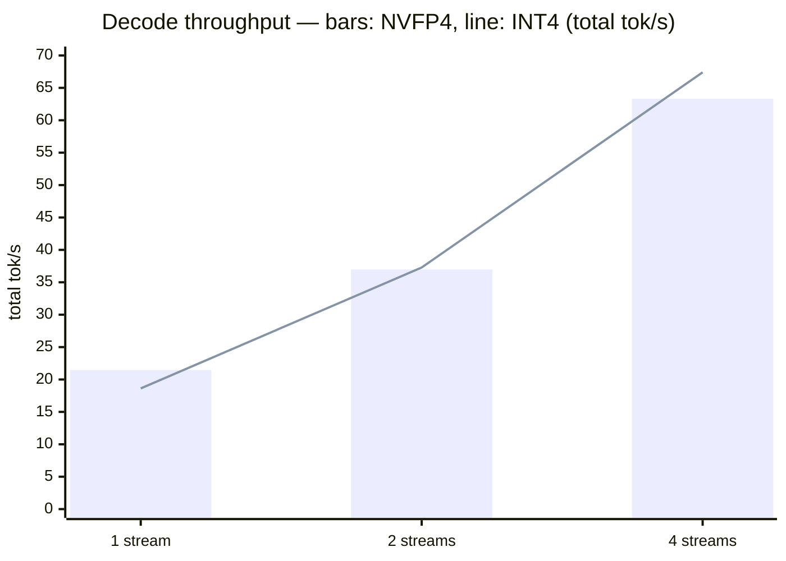
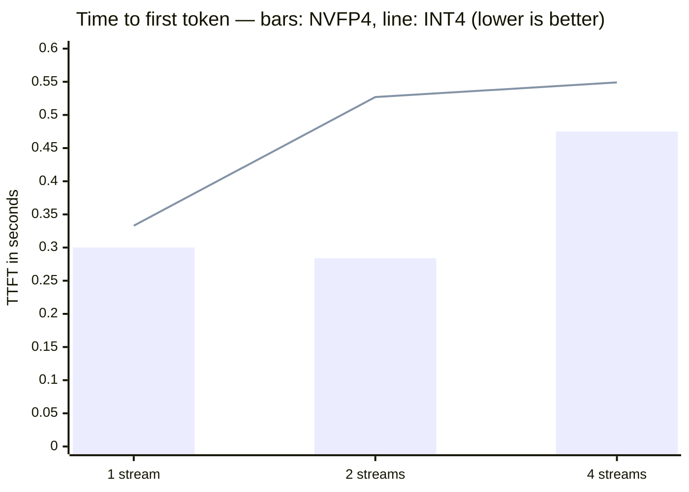
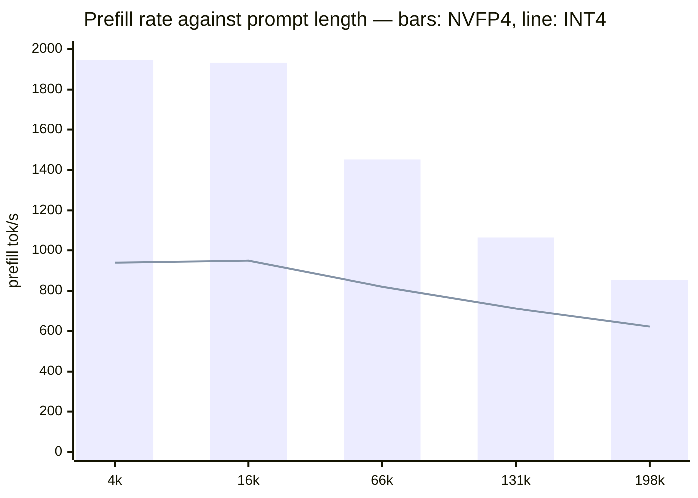
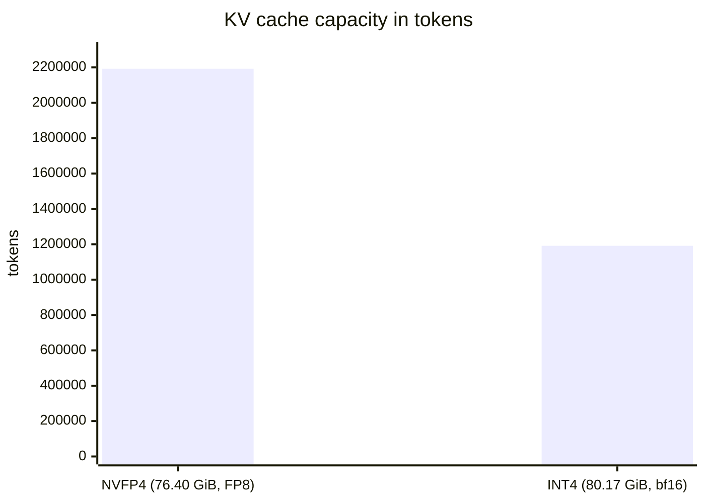

# Qwen3.8-27B on the DGX Spark

*Measurement series · DGX Spark GB10 · 21 August 2026*

> Two 4-bit variants of the same dense model, measured against each other under identical parameters: NVFP4 against INT4. The throughput comparison flips with load, the prefill comparison does not — and the largest difference appears on neither model card.

**Hardware** NVIDIA GB10, sm_121a, 121 GB unified **Engine** vLLM 0.25.1 / torch 2.11.0+cu130 **Data points** 2 × 12 throughput, 2 × 5 prefill

## Contents

1. [At a glance](#at-a-glance)
2. [Key findings](#key-findings)
3. [Model and variants](#model-and-variants)
4. [Test setup](#test-setup)
5. [Startup](#startup)
6. [Decode throughput](#decode-throughput)
7. [Response latency](#response-latency)
8. [Prefill scaling](#prefill-scaling)
9. [The missing prefix cache](#the-missing-prefix-cache)
10. [Memory and KV cache](#memory-and-kv-cache)
11. [Kernel paths](#kernel-paths)
12. [Speculative decoding](#speculative-decoding)
13. [Comparison](#comparison)
14. [Recommendation](#recommendation)
15. [Limitations](#limitations)
16. [Glossary](#glossary)
17. [Artefacts](#artefacts)

## At a glance

Qwen3.8-27B is a **dense** vision-language model with hybrid attention and a built-in MTP head. Both 4-bit variants were measured with identical parameters on the same machine. Neither wins outright.

### Decode: load decides

NVFP4 leads by 16 % at one stream, INT4 by 6 % at four. The crossover sits between c=2 and c=4 — the same pattern as Gemma-4, now on a dense model as well.

### Prefill: NVFP4 throughout

2.04× on short prompts, 1.37× at 198k. No crossover. W4A16 has to unpack weights for every GEMM, which hits the compute-bound prefill.

### KV cache: nearly double

NVFP4 holds 2.19 M tokens, INT4 only 1.19 M — on *less* cache memory. The cause is missing `k_scale`/`v_scale` in the INT4 checkpoint.

### 27 B active, still 21.5 tok/s

Arithmetic says ~9 tok/s. The MTP head accepts 76–89 % of its drafts and lifts the result to the level of an 8 B MoE.

- **21.5** — tok/s decode c=1, NVFP4

- **70.9** — tok/s decode c=4, INT4

- **2.04×** — NVFP4 prefill lead

- **1.0×** — prefix cache effect

## Key findings

1. **The NVFP4/INT4 crossover is a property of the kernels, not of the model.** Gemma-4 (MoE, 4 B active) and Qwen3.8 (dense, 27 B active) show it at the same place with nearly identical percentages.

2. **On prefill there is no crossover.** NVFP4 wins at all five length stages. The lead shrinks with context length because attention — identical in both variants — takes a growing share of the work.

3. **KV cache capacity is set by the checkpoint, not by the quantisation.** The INT4 checkpoint ships no KV scales; vLLM falls back to a bf16 cache and halves capacity. Neither the model name nor the `quantization_config` hints at this.

4. **Speculative decoding is the decisive lever for dense models on this hardware.** It does not lift the bandwidth ceiling, it amortises it across several tokens per pass — exactly what 27 B active parameters at 273 GB/s need.

5. **The prefix cache does not engage here either**, even though every fourth layer is full attention. vLLM disables it automatically for hybrid models.

6. **The 262k context exists nominally but is barely usable.** Prefilling 198k tokens alone takes 3:53 min (NVFP4) or 5:18 min (INT4).

## Model and variants

Qwen3.8-27B differs from the models measured on this machine so far in two fundamental ways: it is **dense** rather than MoE, and it is multimodal.

**Architecture** — `Qwen3_5ForConditionalGeneration` — vision-language, text part `qwen3_5_text`

**Layers** — 64, of which 48 `linear_attention` and 16 `full_attention` (`full_attention_interval = 4`)

**Attention** — 24 query heads, 4 KV heads (GQA), `head_dim` 256, `partial_rotary_factor` 0.25

**Linear layers** — 16 key heads, 48 value heads, 128 dimensions each, `mamba_ssm_dtype` float32

**Context** — 262,144 tokens

**MTP** — `mtp_num_hidden_layers = 1`, embeddings shared with the target model

**Vision** — 27 blocks, `hidden_size` 1152, patch 16 — not exercised in this benchmark

> [!IMPORTANT]
> **"NVFP4" does not mean 4 bit throughout**
>
> The checkpoint is `mixed-precision`: MLP layers are NVFP4 (W4A4, `tensor_group`, group size 16), the attention projections are **FP8** (W8A8, channel-wise). The `linear_attn` blocks are exempt entirely — 303 entries in the `ignore` list. Hence 21.81 GiB rather than the roughly 14 GiB pure FP4 would suggest.

*The two variants compared*

|  | unsloth NVFP4 | RedHatAI INT4 |
|---|---|---|
| Revision | 7d6f8d4d | 2fb0debc |
| Checkpoint size | 21.81 GiB | 18.12 GiB |
| Format | mixed-precision | pack-quantized |
| MLP weights | 4 bit float, gs 16 | 4 bit int, gs 128 |
| Attention weights | 8 bit float, channel | 4 bit int, gs 128 |
| Activations | 4 bit / 8 bit float | bf16 |
| MTP tensors | 15 | 15 |
| `k_scale` / `v_scale` | 16 / 16 | 0 / 0 |

<details>
<summary>Selection — why these two</summary>

The HF API lists over 100 derivatives of Qwen3.8-27B. After excluding GGUF, MLX, AMD Quark and abliterated variants, these remained as serious 4-bit candidates for vLLM on sm_121a:

| Repo | Size | Scheme |
|---|---|---|
| RedHatAI/…-INT4 | 18.1 GiB | INT4 W4A16, gs 128 |
| sakamakismile/…-MTP-NVFP4 | 19.1 GiB | NVFP4 W4A4 throughout |
| cyankiwi/…-AWQ-INT4 | 19.6 GiB | INT4 W4A16, gs 32, AWQ-calibrated |
| RadixArk/…-NVFP4 | 20.4 GiB | modelopt, MTP in bf16 |
| unsloth/…-NVFP4 | 21.8 GiB | mixed NVFP4 + FP8 |
| RedHatAI/…-NVFP4 | 21.8 GiB | config identical to unsloth |
| Inferact/…-NVFP4 | 24.6 GiB | modelopt |

Chosen were `unsloth/Qwen3.8-27B-NVFP4` and `RedHatAI/Qwen3.8-27B-INT4`: both `compressed-tensors`, both formats already run successfully on this machine, and at 21.8 against 18.1 GiB close enough that — unlike Laguna — no memory pressure confounds the comparison.

> [!NOTE]
> **Naming trap: "DSpark" is not the DGX Spark**
>
> Several repos are named `Qwen3.8-27B-DSpark…` and look hardware-specific. They are not: `RadixArk/Qwen3.8-27B-DSpark` is 2.5 GiB, architecture `DSparkDraftModel` — a **draft model for speculative decoding**, a DFlash successor with a confidence head, 1.36 B parameters, 5 full-attention layers, block size 7. Its target is `Qwen/Qwen3.8-27B-FP8`, served via SGLang according to its model card. Not part of this series.

</details>

## Test setup

Both variants ran with the same performance parameters so that only quantisation varies. The values match those of the Qwen3.6 series, keeping the numbers comparable.

```bash
# start-vllm-qwen38-{nvfp4,int4}.sh
export CUTE_DSL_ARCH=sm_121a
export MAX_JOBS=1

vllm serve <model> \
  --revision <pinned> \
  --speculative-config '{"method":"mtp","num_speculative_tokens":3}' \
  --reasoning-parser qwen3 \
  --max-num-seqs 32 \
  --max-model-len 262144 \
  --gpu-memory-utilization 0.85 \
  --host 0.0.0.0 --port 8000
```

Measurement used the two scripts of the existing series: `bench.py` (4 scenarios × 3 concurrency levels × 3 repeats, warm case) and `prefill.py` (5 length stages, each with its own UUID in the prefix, cold case). Both speak the OpenAI-compatible API, so every configuration receives identical requests. A warm-up request precedes each series.

> [!NOTE]
> Revisions are pinned. The reason comes from the Laguna series: poolside had moved `main` to a checkpoint that, despite an unchanged `quantization_config`, contained different weights and invalidated the numbers.

## Startup

Both servers started on the first attempt, with no failed runs. The kernel cache was already warm from the Qwen3.6 series.

*Time to readiness*

| Phase | NVFP4 | INT4 |
|---|---|---|
| torch.compile backbone | 55.19 s | 36.81 s |
| torch.compile MTP head | 6.94 s | 6.67 s |
| CUDA graph memory | 0.22 GiB | 0.10 GiB |
| ready after | 334 s | 309 s |

Both runs report `Add 3 padding layers, may waste at most 6.25 %` — a consequence of the hybrid architecture, where the attention page size must be aligned with that of the Mamba layers.

## Decode throughput

Total throughput across all concurrent requests, median of three runs, scenario `prosa_decode` with 256 output tokens per request.



*The lead changes sides between two and four streams. At two streams both are within 0.8 % of each other — that is the crossover point.*

*All decode data points, total throughput in tok/s*

| Scenario | Streams | NVFP4 | INT4 | Difference |
|---|---|---|---|---|
| prosa_decode | 1 | 21.47 | 18.62 | NVFP4 +15.3 % |
| prosa_decode | 2 | 36.98 | 37.28 | INT4 +0.8 % |
| prosa_decode | 4 | 63.32 | 67.40 | INT4 +6.4 % |
| code_decode | 1 | 19.87 | 18.05 | NVFP4 +10.1 % |
| code_decode | 2 | 39.55 | 38.62 | NVFP4 +2.4 % |
| code_decode | 4 | 65.98 | 70.88 | INT4 +7.4 % |

> [!IMPORTANT]
> **What is actually being measured here**
>
> A spot check after the run returned, for 120 requested tokens, **531 characters in the `reasoning` field and an empty `content`**. At 256 tokens per request, decode throughput here measures reasoning generation almost exclusively; no finished answer is produced in any of the runs. The rate is valid as a rate, but it is not a measure of time-to-answer. The difference between `prosa_decode` and `code_decode` is meaningless for the same reason.

## Response latency

Time to first token, median, scenario `prosa_decode` with a short prompt (35 input tokens).



*On short prompts NVFP4 leads at every level — unlike decode throughput, where INT4 wins from four streams onwards. The outlier at two streams (0.527 s) is the only point where INT4 falls off sharply.*

<details>
<summary>Raw data — all TTFT points</summary>

*Time to first token, median of three runs*

| Scenario | Streams | NVFP4 | INT4 | Difference |
|---|---|---|---|---|
| prosa_decode | 1 | 0.300 s | 0.333 s | NVFP4 −9.9 % |
| prosa_decode | 2 | 0.284 s | 0.527 s | NVFP4 −46.1 % |
| prosa_decode | 4 | 0.475 s | 0.549 s | NVFP4 −13.5 % |
| code_decode | 1 | 0.272 s | 0.336 s | NVFP4 −19.0 % |
| code_decode | 2 | 0.291 s | 0.389 s | NVFP4 −25.2 % |
| code_decode | 4 | 0.471 s | 0.521 s | NVFP4 −9.6 % |

NVFP4 leads on all twelve latency points — unlike throughput, there is no load range where INT4 wins. The lead varies between 9.6 and 46.1 % with no discernible trend across concurrency.

</details>

Both variants sit well above Qwen3.6's 0.094 s and Gemma-4's 0.036 s. That is expected: even at 35 input tokens, a dense model must pull its full weights across the memory bus for the first token.

## Prefill scaling

Cold measurement: every request carries its own UUID in the prefix, so no cache can engage. Five length stages, median of three requests.



*The gap between the lines is the NVFP4 lead; the grey values give it as a factor. It shrinks with context length but never reverses.*

The cause lies in what **W4A16** means: INT4 keeps activations in bf16 and must unpack weights for every matrix multiplication. During a bandwidth-bound decode that cost is immaterial — there it is even an advantage, because Marlin amortises it across the batch. During a compute-bound prefill it dominates, while NVFP4's W4A4 path feeds the FP4 tensor cores directly.

That the factor decays with length fits this: attention is identical in both variants and takes an ever larger share of the work as context grows, so the difference in the linear layers loses relative weight.

*Cold prefill, absolute times*

| Stage | Tokens | NVFP4 TTFT | tok/s | INT4 TTFT | tok/s | Factor |
|---|---|---|---|---|---|---|
| ~5k | 4,126 | 2.12 s | 1,946 | 4.33 s | 939 | 2.04× |
| ~18k | 16,426 | 8.50 s | 1,933 | 17.31 s | 949 | 2.04× |
| ~72k | 65,875 | 45.38 s | 1,452 | 78.62 s | 820 | 1.73× |
| ~145k | 131,204 | 123.12 s | 1,066 | 181.51 s | 712 | 1.47× |
| ~215k | 198,205 | 232.73 s | 852 | 318.05 s | 623 | 1.37× |

<details>
<summary>Raw data — the 8k prefill scenarios from bench.py</summary>

These six data points per variant come from `bench.py`, not `prefill.py`: roughly 14,800 input tokens against only 64 output tokens. Total throughput says little here because the long wait for the first token dominates it — it is listed for completeness.

| Scenario | Streams | NVFP4 TTFT | NVFP4 total | INT4 TTFT | INT4 total |
|---|---|---|---|---|---|
| prefill_8k | 1 | 7.618 s | 6.14 tok/s | 15.769 s | 3.41 tok/s |
| prefill_8k | 2 | 11.962 s | 7.29 tok/s | 24.991 s | 3.71 tok/s |
| prefill_8k | 4 | 19.819 s | 7.77 tok/s | 41.316 s | 3.82 tok/s |
| prefill_8k_wiederholt | 1 | 7.547 s | 6.25 tok/s | 15.860 s | 3.48 tok/s |
| prefill_8k_wiederholt | 2 | 11.991 s | 7.16 tok/s | 24.957 s | 3.76 tok/s |
| prefill_8k_wiederholt | 4 | 19.799 s | 7.83 tok/s | 41.218 s | 3.87 tok/s |

Two observations: the NVFP4 lead here sits consistently at a factor of 2.07–2.09, slightly above that of the cold measurement. And the row pairs `prefill_8k` / `prefill_8k_wiederholt` are identical but for measurement noise — the same missing prefix cache, confirmed from a second data source.

</details>

> [!IMPORTANT]
> **The long context exists nominally but is barely usable**
>
> Prefilling 198,205 tokens costs **3:53 min** with NVFP4 and **5:18 min** with INT4 — before the first output token appears. For comparison, Qwen3.6-35B-A3B needed 81.6 s for the same stage. Anyone wanting to exhaust the 262k here plans in minutes, not seconds.

## The missing prefix cache

The benchmark runs the same 8k scenario twice: once normally, once with an identical prefix. On models with a working prefix cache the second pass is dramatically faster. Not here.

*Warm against cold*

| Variant | cold (16k, own prefix) | warm (15k, repeated) | per token | Effect |
|---|---|---|---|---|
| NVFP4 | 8.50 s | 7.62 s | 0.517 vs 0.514 ms | 1.0× |
| INT4 | 17.31 s | 15.77 s | 1.053 vs 1.063 ms | 1.0× |

Normalised for prompt length, warm and cold are identical. That matches the Qwen3.6 finding — but is more surprising here, because Qwen3.8 is the sharper test: **16 of its 64 layers are full attention** with a real KV cache. A partial cache benefit would therefore have been architecturally possible.

> [!WARNING]
> **The cause is in the engine configuration**
>
> Both server logs report `enable_prefix_caching=False`, although this appears on no command line. vLLM disables the feature automatically for hybrid models. The architecture makes a *complete* prefix cache impossible — linear attention carries a sequentially updated state that cannot be reused piecewise. The engine's response is to switch the feature off entirely rather than cache the 16 eligible layers.

> [!WARNING]
> **Not tested:** whether the partial case can be forced with an explicit `--enable-prefix-caching`, and what it would yield.

Practical consequence for agent workloads: an agent carrying the same 16k context across 20 turns pays for it in full every time. On Qwen3.6 that is 56 s instead of 5 s, on Qwen3.8-NVFP4 roughly 152 s — and on INT4 about double that.

## Memory and KV cache

Here sits the most surprising finding of the series: **INT4 receives more cache memory and still holds only half as many tokens.**



*The bar shows capacity, the caption the memory available for it. The two diverge.*

*Memory split*

|  | NVFP4 | INT4 |
|---|---|---|
| Checkpoint | 21.81 GiB | 18.12 GiB |
| Available KV cache | 76.40 GiB | 80.17 GiB |
| `k_scale`/`v_scale` in checkpoint | 16 / 16 | 0 / 0 |
| KV cache dtype | FP8 | bf16 |
| Attention block size | 1,600 tokens | 800 tokens |
| KV cache capacity | 2,192,477 | 1,191,213 |

The unsloth NVFP4 checkpoint ships one `k_scale` and one `v_scale` for each of its 16 full-attention layers. That lets vLLM keep the KV cache in FP8, which costs half per token. The RedHatAI INT4 checkpoint ships none, so the engine falls back to bf16.

> [!IMPORTANT]
> **The same failure class as Laguna, only milder**
>
> In the Laguna series an upstream checkpoint without KV scales meant the server would not start at all at `--max-model-len 262144`. Here the same circumstance merely halves capacity — at 121 GB unified that goes unnoticed. What is remarkable is how **invisible** the property is: neither the model name nor the `quantization_config` mentions it. It becomes visible only by counting the `*_scale` tensors in `model.safetensors.index.json`.

<details>
<summary>Check command</summary>

```bash
python3 -c "
import json
d = json.load(open('model.safetensors.index.json'))['weight_map']
print('k_scale:', sum(1 for k in d if k.endswith('k_scale')))
print('v_scale:', sum(1 for k in d if k.endswith('v_scale')))
"
```

A result of `0 / 0` means a bf16 KV cache and therefore twice the cost per token — regardless of how small the checkpoint itself is.

</details>

## Kernel paths

vLLM logs which kernels it selects at startup. The two variants differ not only in the GEMM path but also in the attention backend.

*Selected implementations*

|  | NVFP4 | INT4 |
|---|---|---|
| Linear layers | FlashInferCutlassNvFp4LinearKernel | MarlinLinearKernel |
| Attention backend | FLASHINFER | FLASH_ATTN (FA 2) |
| Candidates per log | FLASHINFER, TRITON_ATTN | FLASH_ATTN, FLASHINFER, TRITON_ATTN, FLEX_ATTENTION |

> [!WARNING]
> **The comparison is broader than it looks**
>
> In the NVFP4 configuration `FLASH_ATTN` was not offered as a candidate at all — vLLM listed only `FLASHINFER` and `TRITON_ATTN`. The measured differences therefore stem from **two complete engine configurations**, not from quantisation alone. How much of the prefill lead belongs to the GEMM path and how much to the attention backend is not separated by this series.

The finding matches the explanation from the Gemma-4 series: Marlin amortises its unpacking cost over the batch and therefore grows relatively stronger under load, while the FlashInfer-CUTLASS path already operates near its optimum at a single stream and has little headroom left.

## Speculative decoding

Both runs used the model's built-in MTP head with three draft tokens. Without it the result would be a different one.

> [!NOTE]
> **Why 21.5 instead of the expected 9 tok/s**
>
> 21.81 GiB of weights must cross a bus of roughly 273 GB/s for every token. That gives an arithmetic ceiling of about 12 tok/s, realistically closer to 9. Measured were 21.5. The difference comes from the MTP head: it does not lift the bandwidth ceiling, it spreads it across several accepted tokens per pass.

*SpecDecoding metrics, INT4 run, samples from the server log*

| Mean acceptance length | Per-position rate | Acceptance rate |
|---|---|---|
| 3.25 | 0.875 / 0.750 / 0.625 | 75.0 % |
| 3.64 | 1.000 / 0.857 / 0.786 | 88.1 % |
| 3.29 | 0.927 / 0.732 / 0.634 | 76.4 % |
| 3.67 | 1.000 / 0.889 / 0.778 | 88.9 % |
| 3.44 | 0.889 / 0.889 / 0.667 | 81.5 % |
| 3.31 | 1.000 / 0.692 / 0.615 | 76.9 % |

Mean acceptance length lands between 3.25 and 3.67 of a maximum 4 tokens per pass. The per-position rates fall off as expected — the third draft token is accepted in only 62–79 % of cases. vLLM warns explicitly at startup that `num_speculative_tokens > 1` runs the same MTP layer repeatedly and depresses the acceptance rate.

> [!IMPORTANT]
> **Not measured:** the same run without MTP. The contribution of speculative decoding is inferred here from the difference to the bandwidth calculation, not measured directly. Also open is whether a value other than 3 draft tokens performs better.

## Comparison

Against the models measured on the same machine so far, Qwen3.8-27B places as follows:

*All configurations of this series*

| Configuration | active params | decode c=1 | decode c=4 | best TTFT | KV cache |
|---|---|---|---|---|---|
| Laguna-S-2.1 NVFP4 | 8 B | 17.3 | 42.7 | 0.352 s | 94,135 |
| Laguna-S-2.1 INT4 (vLLM) | 8 B | 20.6 | 52.8 | 0.260 s | 1,001,532 |
| Qwen3.6-35B-A3B NVFP4 | 3 B | 60.7 | 201.2 | 0.094 s | 3,366,051 |
| Gemma-4-26B-A4B NVFP4 | 4 B | 53.0 | 170.6 | 0.036 s | 3,912,140 |
| Gemma-4-26B-A4B INT4 | 4 B | 43.9 | 177.1 | 0.038 s | 3,875,400 |
| Qwen3.8-27B NVFP4 (dense) | 27 B | 21.5 | 66.0 | 0.272 s | 2,192,477 |
| Qwen3.8-27B INT4 (dense) | 27 B | 18.6 | 70.9 | 0.333 s | 1,191,213 |

The core finding of the series holds: **the number of active parameters dominates everything else.** Qwen3.8 is the exception that confirms it — at 27 B active, 3.4× Laguna's count, it nonetheless lands at Laguna's level thanks to MTP. Against the MoE field with 3–4 B active it is short by a factor of three, and on prefill by a factor of 2.6 against Qwen3.6.

*Qwen3.8 NVFP4 against Qwen3.6 NVFP4 — dense against MoE*

|  | Qwen3.6-35B-A3B | Qwen3.8-27B | Ratio |
|---|---|---|---|
| active parameters | 3 B | 27 B | 9.0× |
| decode c=1 | 60.7 | 21.5 | 0.35× |
| decode c=4 | 201.2 | 66.0 | 0.33× |
| TTFT short | 0.094 s | 0.272 s | 2.9× |
| prefill 4–5k | 5,064 tok/s | 1,946 tok/s | 0.38× |
| prefill 198k | 2,429 tok/s | 852 tok/s | 0.35× |
| KV cache | 3,366,051 | 2,192,477 | 0.65× |
| prefix cache effect | 1.0× | 1.0× | — |

> [!IMPORTANT]
> This comparison concerns speed only. **Response quality was not measured.** Whether 27 B dense delivers more per token than 3 B active out of 35 B is precisely the question this series does not answer — and the one that would decide a model choice.

## Recommendation

### Between the two variants

**NVFP4 for interactive use.** It wins at one stream (+16 %), on response latency at every load level, on prefill throughout (factor 1.37–2.04) and on KV cache capacity (1.8×). The only area where INT4 leads is decode throughput from four concurrent streams onwards — and there by 6 %.

**INT4 only under sustained batch load**, where prefills stay short and throughput is what counts. Anyone taking that route should be aware of the halved KV cache capacity — immaterial at 121 GB unified, not so on smaller hardware.

### For this model at all

On this machine Qwen3.8-27B is a model for **short contexts and patient users**. Two properties effectively rule out agent workloads: the missing prefix cache, which charges for every carried context on every turn, and the prefill rate, which counts in minutes rather than seconds at large contexts. For tasks with short prompts and bounded output it is usable, and the MTP head is what makes 27 B dense defensible on this hardware in the first place.

> [!NOTE]
> **Untested alternatives**
>
> Two further runs suggest themselves from the candidate list: `sakamakismile/…-MTP-NVFP4` (19.1 GiB, W4A4 throughout rather than mixed — smaller, but with 4-bit attention and the corresponding quality risk) and `cyankiwi/…-AWQ-INT4` (group size 32 instead of 128, AWQ-calibrated). Also open: the DSpark drafter with 1.36 B parameters against the built-in single-layer MTP head — though its model card targets SGLang.

## Limitations

- **Response quality was not measured.** No difference between NVFP4 and INT4 in these numbers says anything about which variant answers better.

- **Decode measures reasoning tokens.** A spot check returned an empty `content` field and 531 characters of `reasoning` for 120 tokens. The rates are valid as rates but are not a time-to-answer. The comparison between `prosa_decode` and `code_decode` is meaningless as a result.

- **Two engine configurations, not two quantisations.** The variants ran on different attention backends (`FLASHINFER` against `FLASH_ATTN`), because vLLM offered no FlashAttention for NVFP4 at all.

- **Concurrency measured only up to 4.** The INT4 lead was still growing at the last level — where it ends is untested.

- **The MTP contribution is inferred, not measured.** A comparison run without speculative decoding is missing, as is a variation of the draft token count.

- **Vision was not exercised.** Qwen3.8-27B is multimodal; all measurements are pure text load.

- **One series per configuration**, three repeats per point, no averaging across sessions. A spot check in the existing series showed 1.4 % deviation between two runs of the same configuration.

- **`--enable-prefix-caching` was not forced.** Whether a partial cache across the 16 full-attention layers would yield anything remains open.

## Glossary

**NVFP4**
NVIDIA's 4-bit floating-point format for Blackwell tensor cores, scaled per small group. Here `tensor_group` with group size 16.

**W4A16 / W4A4 / W8A8**
Bit width of weights (W) and activations (A). W4A16 saves memory only; W4A4 additionally uses the hardware's 4-bit compute paths.

**dense / MoE**
A dense model activates all parameters for every token. A mixture-of-experts activates only a fraction — hence the distinction between total and active parameters.

**MTP — multi-token prediction**
An extra head in the model that proposes several following tokens. The main model verifies them in one pass and keeps those that match.

**Linear attention / GDN**
An attention variant with a sequentially updated state instead of a growing KV cache. Saves memory but prevents piecewise reuse of a prefix.

**Prefill / decode**
Prefill processes the input prompt and is compute-bound. Decode produces output token by token and is memory-bandwidth-bound.

**TTFT**
Time to first token — from request to the first token emitted.

**`k_scale` / `v_scale`**
Per-attention-layer scaling factors that enable a quantised KV cache. Without them the engine falls back to bf16 and doubles the cost per token.

**Marlin**
GPU kernel for INT4 weights with bf16 activations. Unpacks weights at runtime and amortises that cost across the batch.

**Prefix cache**
Reuse of already computed KV entries for an identical prompt beginning. Called "APC" in vLLM, "RadixAttention" in SGLang.

## Artefacts

All raw data and scripts of this series are in the repository:

| File | Contents |
|---|---|
| start-vllm-qwen38-nvfp4.sh | launch script NVFP4, revision pinned |
| start-vllm-qwen38-int4.sh | launch script INT4, revision pinned |
| run-qwen38-bench.sh | waits for readiness, runs both measurement scripts |
| chain-qwen38-int4.sh | switchover from the NVFP4 to the INT4 run |
| ergebnisse_qwen38-nvfp4.json | 12 throughput data points, NVFP4 |
| ergebnisse_qwen38-int4.json | 12 throughput data points, INT4 |
| prefill_qwen38-nvfp4.json | 5 prefill stages, NVFP4 |
| prefill_qwen38-int4.json | 5 prefill stages, INT4 |
| qwen38-nvfp4.log | server log incl. kernel selection and SpecDecoding metrics |
| qwen38-int4.log | same for INT4 |

**NVFP4** — `unsloth/Qwen3.8-27B-NVFP4` @ `7d6f8d4d72f56b92b3cdbf22f156b90e1bab0108`

**INT4** — `RedHatAI/Qwen3.8-27B-INT4` @ `2fb0debc365fb6c1683d7d3ad7722470919627a8`

---

*Measurement series of 21 August 2026 · DGX Spark GB10, sm_121a · vLLM 0.25.1, torch 2.11.0+cu130 · All values measured on this hardware, median of three runs · Response quality not assessed*
